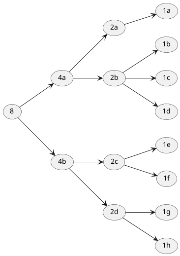
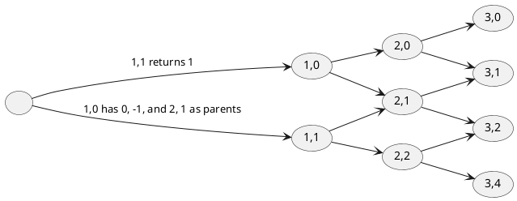
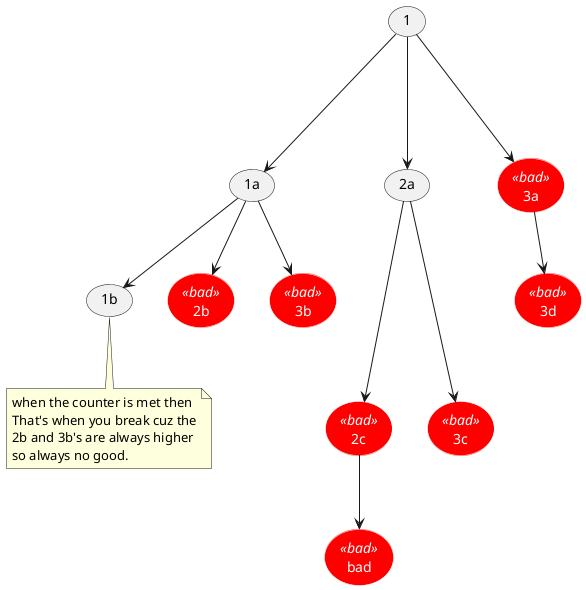

## progfun1-example

* Takeaways
  * [ ] Call By Value and Call By Name
  * [ ] Conditionals
  * [ ] Implicit python-ish last line return.
  * [ ] String interpolation
  * [ ] No ternarys

* Code
  * Create a square root program in Scala using the Babylonian way.
    * The best way to understand the Babylonian or newtonian way is to graph two parabolas. The only thing i could not understand was how the actual/guess parabola would never be greater than the guess averaging.
    * (g + a/g ) / 2 
  * `println(s"Hello, $name")`  // Hello, James
  *  `def mario(param:=> Int) = param` for call by name
  *  
    ```scala
    lazy val example = 2 // evaluated once when needed
    val example = 2      // evaluated immediately
    def example = 2      // evaluated when called
    // which means functions are evaluated when called. neat.
    ```
    



actual = 8

| guess              | a/g               | mean               | mean* mean        |
| ------------------ | ----------------- | ------------------ | ----------------- |
| 8                  | 1                 | 4.5                | too high          |
| 4.5                | 1.777             | 3.1385             | 9.8               |
| 3.1385             | 2.548988370240561 | 2.8437441851202805 | 8.086880990405408 |
| 2.8437441851202805 | 2.813192565582909 | 2.8284683753515947 |                   |
|                    |                   |                    |                   |
|                    |                   |                    |                   |

so its about 3 steps plus the amount of extra steps i gave. 
logN + 5 or so. so 8 steps or so. Which is generally what it is.

---

## Homework Recfun
file: progfun-recfun
---

### Pascal's Triangle


Some notes. Because I did this sideways, it does not match the code, columns and rows were switched somewhat but I needed a example case to see if going up and left and up and right actually got where I needed.
```
coord2,1
prev (col -1 = 1) check
      row -1 = 0 check
next ( col-1 = 1 check
      row + 0 = 1 check // hrm.
      
2,0 (col -1 = 1) chceck
    row -1  = undefined check.
    row = 0;  check.
    
3,1  => 2,0: 2,1
   col -1 = 2 check.
   row - 1 = 0 check.
   col - 1  = 2
   row + 0 = 1 check.
```

### Balancing parenthesis

:-)

())(
+--+
10-0
so if anytime its negative then it's no good.
loop through
if ) then -1
( +1


## Change counter
For change counter, the dumb way was to make a set and have all the uniques be placed in there
but if you draw it out.
If the List was 1 2 3 
If the target was 3.


Youll prolly wanna do an example with 2,3,4 so you can get a case
where the 1 1 1 doesnt always add up to your target.

So when it's equal you break from the loop.
You'll also want to record that you matched.

If the summed counter is > you also break from the loop

If it's less you keep recursioning.

The tricky part is that each recursion must be sliced to the iteration.
The takeaway here is to get to the For LOOP recusion, you must identify that
you want the 1s to always have the full set of arrarys.

loop thru slice(0)

you want the 2s to have the 2nd slice.
loop thru slice(1);

Having identified the indexes, you can then do logic.
This took me way too long to figure out. Draw everything evne simple stuff.