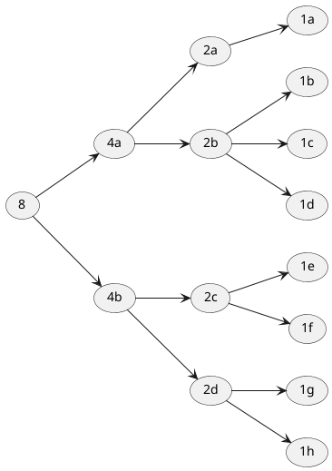

## progfun1-example

* Takeaways
  * [ ] Call By Value and Call By Name
  * [ ] Conditionals
  * [ ] Implicit python-ish last line return.
  * [ ] String interpolation
  * [ ] No ternarys

* Code
  * Create a square root program in Scala using the Babylonian way.
    * The best way to understand the Babylonian or newtonian way is to graph two parabolas. The only thing i could not understand was how the actual/guess parabola would never be greater than the guess averaging.
    * (g + a/g ) / 2 
  * `println(s"Hello, $name")`  // Hello, James
  *  `def mario(param:=> Int) = param` for call by name
  *  
    ```scala
    lazy val example = 2 // evaluated once when needed
    val example = 2      // evaluated immediately
    def example = 2      // evaluated when called
    // which means functions are evaluated when called. neat.
    ```
    



actual = 8

| guess              | a/g               | mean               | mean* mean        |
| ------------------ | ----------------- | ------------------ | ----------------- |
| 8                  | 1                 | 4.5                | too high          |
| 4.5                | 1.777             | 3.1385             | 9.8               |
| 3.1385             | 2.548988370240561 | 2.8437441851202805 | 8.086880990405408 |
| 2.8437441851202805 | 2.813192565582909 | 2.8284683753515947 |                   |
|                    |                   |                    |                   |
|                    |                   |                    |                   |

so its about 3 steps plus the amount of extra steps i gave. 
logN + 5 or so. so 8 steps or so. Which is generally what it is.


